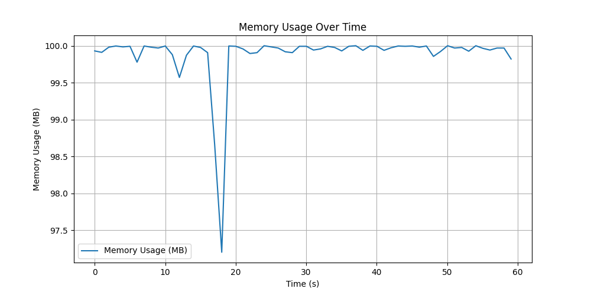

# Анализ работы скрипта с ограничением cgroups

## Описание эксперимента

В рамках эксперимента было настроено ограничение использования оперативной памяти и swap в cgroup для тестируемого процесса. Ограничения были заданы через файл `setup_cgroup.sh`:
- Ограничение на использование **оперативной памяти**: `100 MB`

После этого был запущен стресс-тестовый скрипт `stress_test.py`, который намеренно потреблял значительные объемы ресурсов (CPU, оперативной памяти и I/O), чтобы проверить реакцию системы на достижение лимитов.

## График использования памяти

На графике можно увидеть, как процесс постепенно увеличивает использование памяти, пока не достигает заданного лимита в 100 MB.

## Показания команды `free -m` в начале

`bash
mvliksakov@LAPTOP-7FJQG9BP:/mnt/c/Users/lixak/hse$ free -m
              total        used        free      shared  buff/cache   available
Mem:           7612         144        7044           0         423        7235
Swap:          2048         374        1673
`

## Показания команды `free -m` в конце

`basg
mvliksakov@LAPTOP-7FJQG9BP:/mnt/c/Users/lixak/hse$ free -m
              total        used        free      shared  buff/cache   available
Mem:           7612         241        6945           0         425        7137
Swap:          2048        2038           9
`

Ниже приведены ключевые моменты использования оперативной памяти и swap:

1. **До запуска скрипта**:
   - Оперативная память в основном свободна.
   - Swap практически не используется.

2. **После запуска скрипта**:
   - Оперативная память начала быстро заполняться.
   - После достижения лимита в 100 MB (заданного в cgroups) началось активное использование swap.

3. **Максимальное использование swap**:
   - Swap заполнился почти полностью (2048 MB), так как процесс продолжал выделять память.
   - Это видно в выводе `free -m`, где swap сначала медленно заполняется, а затем достигает своего лимита.

4. **Срабатывание OOM Killer**:
   - После полного заполнения swap система не смогла выделить память для процесса.
   - В результате был вызван механизм **Out of Memory Killer (OOM Killer)**, который завершил процесс, чтобы предотвратить сбой системы.
   - Это видно на графике, где использование памяти резко падает до нуля.

## Подробное объяснение поведения

1. **Ограничение памяти**:
   - Cgroups были настроены так, чтобы ограничить оперативную память до 100 MB. 
   - Как только процесс достиг этого лимита, дальнейшее выделение памяти начало происходить за счет swap.

2. **Использование swap**:
   - Swap использовался для компенсации нехватки оперативной памяти.
   - Swap заполнялся постепенно, пока не достиг лимита в 2048 MB.

3. **Срабатывание OOM Killer**:
   - После полного заполнения оперативной памяти и swap процесс не мог продолжить выполнение.
   - Система активировала механизм OOM Killer, чтобы завершить процесс и освободить ресурсы.

4. **После завершения процесса**:
   - После завершения процесса видно, что оперативная память и swap снова освободились.
   - Это подтверждается показаниями `free -m`, где использование ресурсов возвращается к изначальному состоянию.

